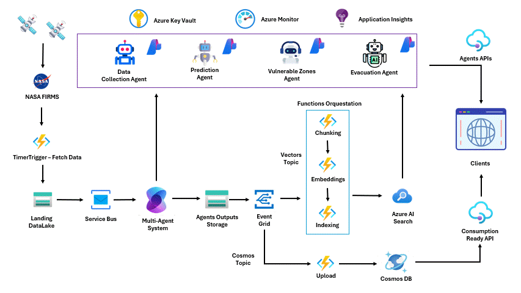

# 🔥 Ignis Sentinels: Near Real-Time Multi-Agent Wildfire Resilience Platform

## 🌍 Mission
Our mission is to develop a cutting-edge wildfire resilience platform that predicts fire behavior, assesses risks, optimizes response strategies, and delivers actionable insights — empowering emergency responders, planners, and policymakers to protect lives, property, and ecosystems.

## 🚨 Challenge: Wildfire Resilience
Wildfires are increasing in frequency and intensity, threatening ecosystems, infrastructure, and communities. Our solution addresses this by:

- Predicting wildfire spread and intensity using near real-time data and AI.
- Assessing risks to infrastructure, natural resources, and populations.
- Recommending optimal resource allocation and evacuation strategies.
- Providing interpretable, actionable insights to decision-makers.

## 🧠 Features
- **AI-Powered Fire Detection**: Near real-time satellite data processed with ML models trained on diverse datasets to reduce bias.
- **Risk Assessment Dashboard**: Interactive map with fire perimeters, wind, terrain, and infrastructure overlays.
- **Agent-Based Interaction**: Each AI agent has a defined role and only responds to wildfire-related prompts.
- **Cross-Platform Access**: Interfaces accessible via web and mobile.

## 🛠️ Tech Stack
- **Frontend**: Streamlit , Deck.gl
- **Backend**: Python (FastAPI) + CosmosDB
- **AI Models**: agentpy + OpenAI Models
- **Data Sources**: NASA FIRMS, OpenWeatherMap, Sentinel-2, VIIRS
- **Infra**: Azure Functions + Azure AI Foundry

## Project Architecture

## Video Demo and Slides 
- Video: https://youtu.be/9oH7Su1_jtM
- PPT Slides: https://docs.google.com/presentation/d/1_rBSrRaq27KAtp0PPKlCQBqJ95p1MWdU/edit?pli=1&slide=id.p3#slide=id.p3

## 🔐 Responsible AI Commitments

| Principle       | Implementation                                                                 |
|----------------|----------------------------------------------------------------------------------|
| **Fairness**    | Trained on diverse geospatial and climatic data to reduce regional bias.        |
| **Reliability** | Includes prediction confidence scores and system performance validation.        |
| **Privacy**     | No personal data collected; only emergency contacts and fire-related metadata.  |
| **Inclusivity** | Interfaces are WCAG-compliant and usable by both experts and the general public.|
| **Transparency**| Near real-time fire reports, agent cards, and full event traceability.               |
| **Accountability** | Team listed in repo, disclaimer included, and contact form for issue reporting.|

## 📊 Metrics & Monitoring
- Fire Radiative Power (FRP)
- Brightness vs. Bright_T31 anomaly detection
- Model confidence thresholds
- System latency and uptime logs

## 📎 Disclaimer
This tool is intended for wildfire monitoring and decision support. It does not replace official emergency services. Use responsibly.

## 👥 Team
- [Jair Nieto](https://github.com/CJ-Nieto)
- [Andrés Moreno](https://github.com/RobertDalton)
- [Kevin Góngora](https://github.com/kevinjordanuc)

## 📬 Feedback & Issues
Please [open an issue](https://github.com/...) or contact us.